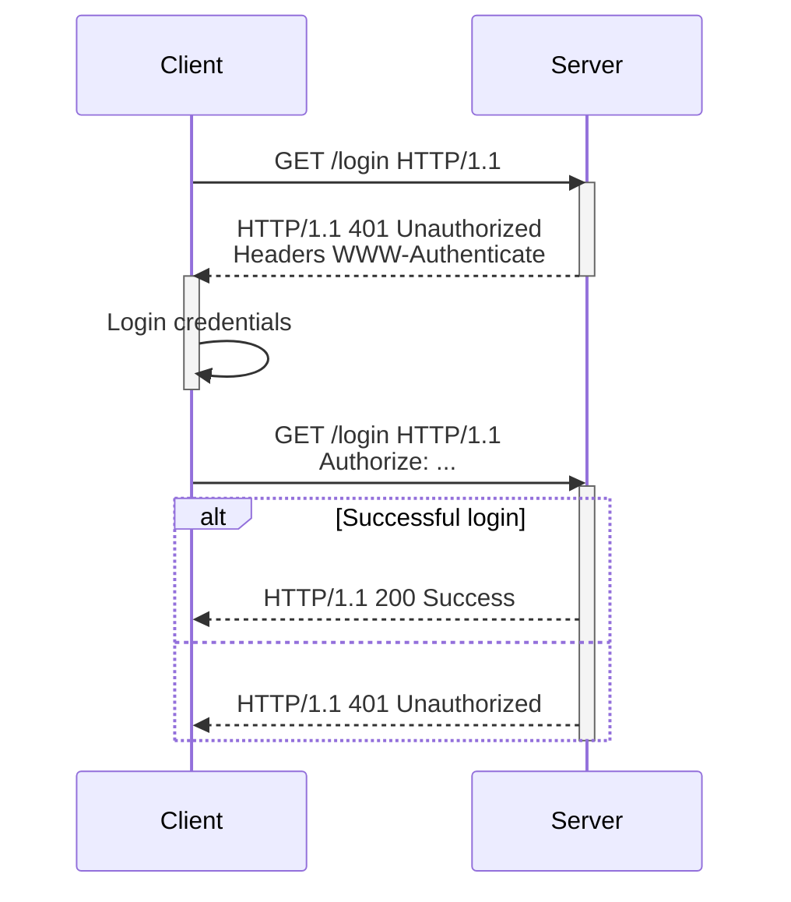

---
tags:
  - notes
  - backend
  - networking/communication/protocols/http
  - security/authentication
Draft: false
"Parent:":
  - "[[Hypertext Transfer Protocol]]"
---
## Response flow example
1. Client sends request to server
2. Server responds with status code `401` `Unauthorized` and sends a header `WWW-Authenticate` or `Proxy-Authenticate` if it's from a proxy server. The header value indicates the method for authorization needed
3. The client can send a request including a header of either `Authorize` or `Proxy-Authorize`, which include the credentials for authorization
	- If successful, server can return status code `200`
	- If unsuccessful, server can send status code `401` `Unauthorized`. To hide the existence of a resource, `404` `Not Found` can also be returned

## Authentication schemes
- Basic
- Bearer
- Digest
- HOBA
- Mutual
- Negotiate / NTLM
- VAPID
- SCRAM
- AWS4-HMAC-SHA256
# References
https://developer.mozilla.org/en-US/docs/Web/HTTP/Guides/Authentication#restricting_access_with_nginx_and_basic_authentication

# Questions
- What is base64 encoded? What does encoding mean. Encoding just transforms to another "readable" data format. It is not for security.
# Anki
- Challenge and response flow
- header names
- Authentication schemes
