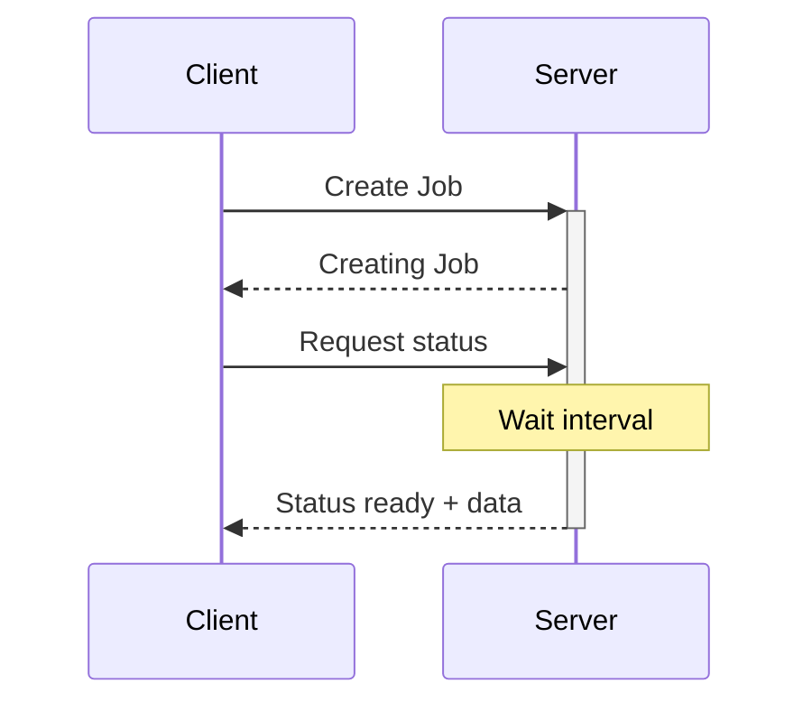

---
tags:
  - notes
  - backend
  - backend
  - networking/communication
Draft: false
"alternatives:":
  - - Notes/Polling|Short Polling
---

# Long Polling
This is a communication method similar to [[Notes/Polling|Short Polling]] where the difference lies when a client checks the job status from the server, the server does not return a response until the job is done.

# Process
