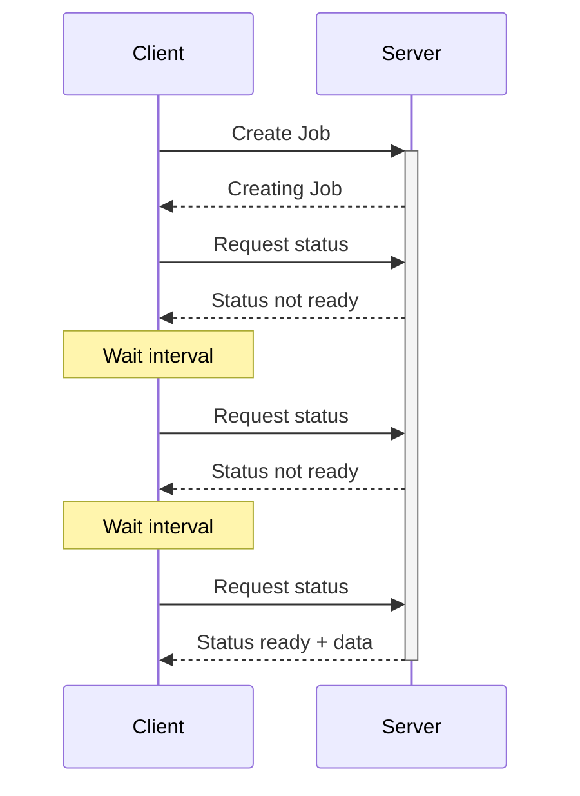

---
tags:
  - notes
  - backend
  - communication
Draft: false
aliases:
  - Short Polling
---

# Short Polling
Short polling is a communication method where a client can check the status of a job or task being executed by a server by sending requests.

# Process

1. Client sends a request to create a job
2. The first response returns a handle or a job ID.
3. While the job is still being processed, the client can further send requests to check the status of the job.
4. When the job is done, it is indicated in the response.

# Pros
- Simple to implement
- Client can disconnect
	- Handle or job ID can be retrieved from local disk or requesting the job ID from the server, etc.
- Better for long running tasks
	- For example, converting a file to another format
# Cons
- Can be too chatty
- Can overload server
	- wasted network bandwidth and server resources