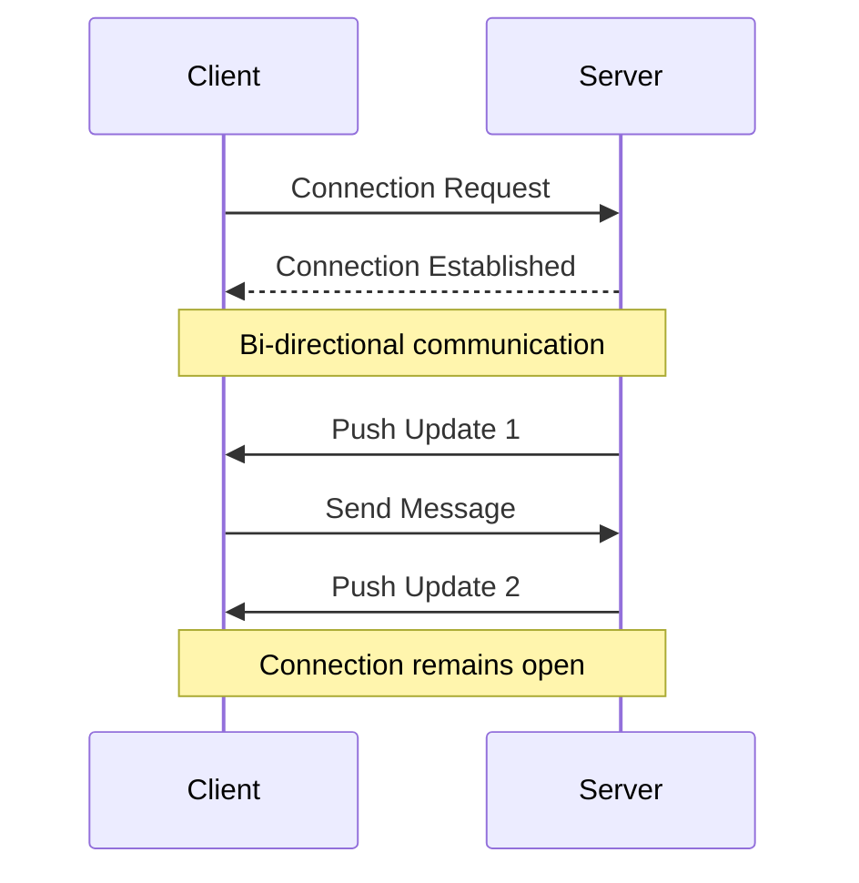

---
tags:
  - notes
  - backend
  - backend
  - communication
Draft: false
aliases:
  - Websockets
"related:":
  - "[[Request Response Model]]"
"similar:":
  - "[[Notes/Server Sent Events|Server Sent Events]]"
---

The push communication method refers to the reliance of the server to **push** updates to clients as soon as those updates are available.
- Bidirectional communication between server and client

# Process

# Pros
- real time updates
# Cons
- Server has no knowledge of client's capabilities of receiving x number of pushes
	- In this case, long polling is better for lighter clients
- Client must be connected

# Establishing a push connection
Initially, a client requests a connection with a server. This utilizes the [[Request Response Model]]. After the connection is established, the server pushes updates to connected clients.

# Examples
- chat applications
- notifications
