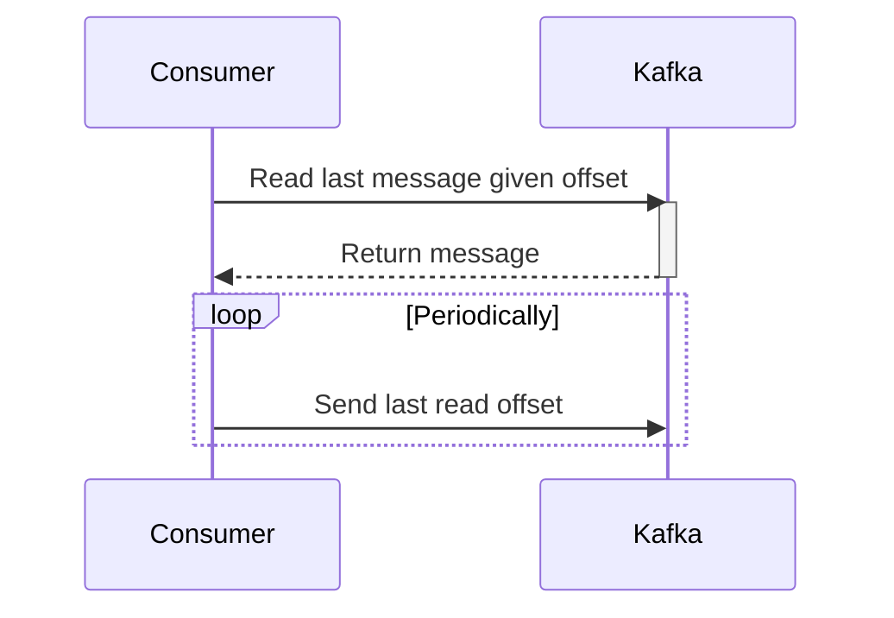

---
tags:
  - reference-notes
  - backend
  - system-design
  - tool
source_url: https://www.hellointerview.com/learn/system-design/deep-dives/kafka
Draft: false
has-questions: false
"Friend:":
  - "[[Stream]]"
  - "[[Message Queue]]"
---

- Apache Kafka is a distributed event streaming platform
- Used as either message queue or stream

# Terminologies and Components
## Kafka Cluster
Contains multiple [[#Broker]]
## Broker
Server containing partitions that producers send messages to and consumers consume from
## Topic
Logical grouping of partitions
## Partition
- Individual storage of message queue
- append-only log file
- immutable
- can be replicated -> master-slave(leader-follower) replication
	- Ideally, across different brokers
## Producer
writes messages to partitions
## Consumer
reads messages from partitions. Only 1 consumer per partition
## Message
- default, 1mb max
- No message number limit
- No max message size limit
- Structure
	- Headers - includes metadata that can be used for various purposes
	- Key - also the partition key
	- Value
	- Timestamp
# Basic flow
## Sending of message to a topic
- Includes partition key?
	- yes
		- hash(key) % N to get partition
	- no
		- round-robin or other logic
- Assignment of message to partition

## Consumption of messages

# Use cases
## As a [[Message Queue]]
1. Asynchronous processing
2. Large number of requests to process - first in first out(FIFO) - tickets, messages
3. Decouple producer and consumer
## As a [[Stream]]
1. Each message needs to be processed by multiple consumers
2. Need to immediately process real-time data

# Kafka in System Design Interview
## Scalability
- Keep messages sizes within 1mb
- good partition key designs - avoid hot partitions
- horizontal scaling
## Durability
- replica count
- ack config
	- Should all replicas ack before continuing processing or X acks or fully eventually consistent?
## Errors and failures
- Alongside a main topic, have a retry topic and a dead-letter queue(DLQ) topic
## Performance optimizations
- Producer can batch messages to send
- compress messages prior to sending
## Retention Policy
- specify time until messages are cleaned up
