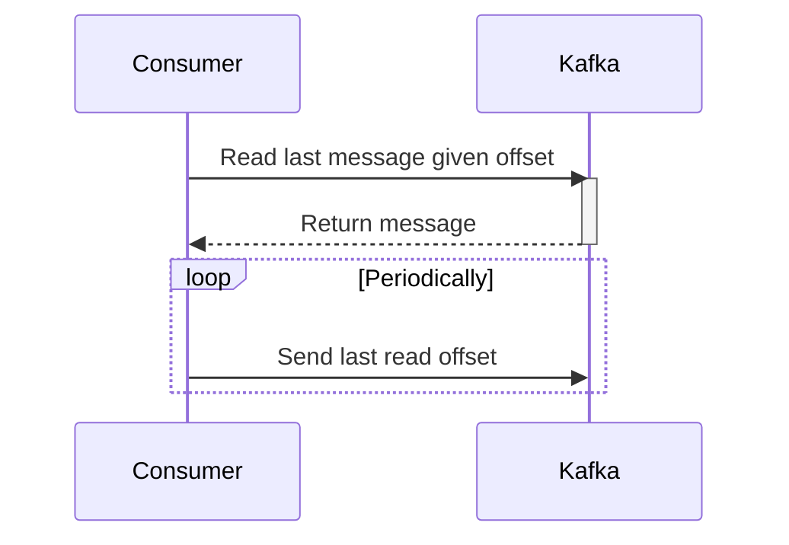

---
tags:
  - reference-notes
  - backend
  - system-design
  - tool
source_url: https://www.hellointerview.com/learn/system-design/deep-dives/kafka
Draft: true
has-questions: true
---
# Introduction

# Terminologies
Broker - server containing partitions that producers send messages to and consumers consume from
Topic - Logical grouping of partitions
Partition - Individual storage of message queue. append-only log file
Producer - writes messages to partitions
Consumer - reads messages from partitions

## Kafka Broker
- a server
- Contains partitions
- a partition can have replicas
# Basic flow
## Creation of Message
Structure
- Headers
- Key - also the partition key
- Value
- Timestamp
## Sending of message to a topic
- Includes partition key?
	- yes
		- hash(key) % N to get partition
	- no
		- round-robin or other logic
- Assignment of message to partition

## Consumption of messages

# Use cases
1. Asynchronous processing
2. Large number of requests to process - tickets, messages
3. streams

# Kafka in System Design Interview
## Scalability
- Keep messages sizes within 1mb
## Durability
- replica count
- ack config
	- Should all replicas ack before continuing processing or 
## Errors and failures
- Alongside a main topic, have a retry topic and a dead-letter queue topic
## Performance optimizations
- Producer can batch messages to send
- compress messages prior to sending
## Retention Policy
- specify time until messages are cleaned up

# Questions
- What if a consumer fails to process a message?
- What are streams vs message queues
- What are possible headers?
- timestamp format?
- key format? value format?
- how to configure replicas?
- how to configure brokers?
- message size?
- message limit?
- is key = partition key?
- What is the AWS equivalent
- How does kafka know that committing of a message has failed?
- retry topic and DLQ topic?